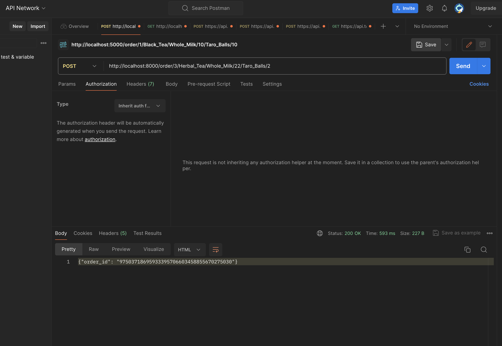
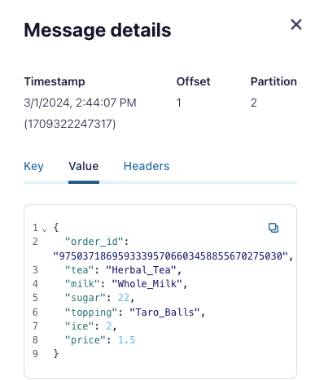

This is the practice of kafka microservice architecture.
The subject is to manage the operation of boba tea shop. 
Once the shop receives the order, it will start working with the boba tea.
Client can place the order through the API call detailing the specification for the drinks.\
It consists of five steps of processing the operation:
1. tea
2. sugar
3. milk
4. topping
5. ice

In this case, I use Flask framework to build the APIs for the app,
which allow client to specify the drink components as parameters for each step.

(POST)\
count: number of drinks\
tea: type of tea\
milk: amount of milk\
sugar: amount of sugar\
topping: type of topping\
ice: amount of ice
localhost:8000/order/<count<f>>/<tea<f>>/<milk<f>>/<sugar<f>>/<topping<f>>/<ice<f>>\

Once client calls the API, the message will be consumed as soon as it arrives the topic.\

The message will go through each topic of this streaming pipeline.\
Once the message's consumed by the app subscribing to the topic it arrives.
The app will start executing the corresponding operation step.

The stream processing follows the following order:\
tea -> milk -> sugar -> topping -> ice

Once the order is done, the client can retrace the price and the drink.